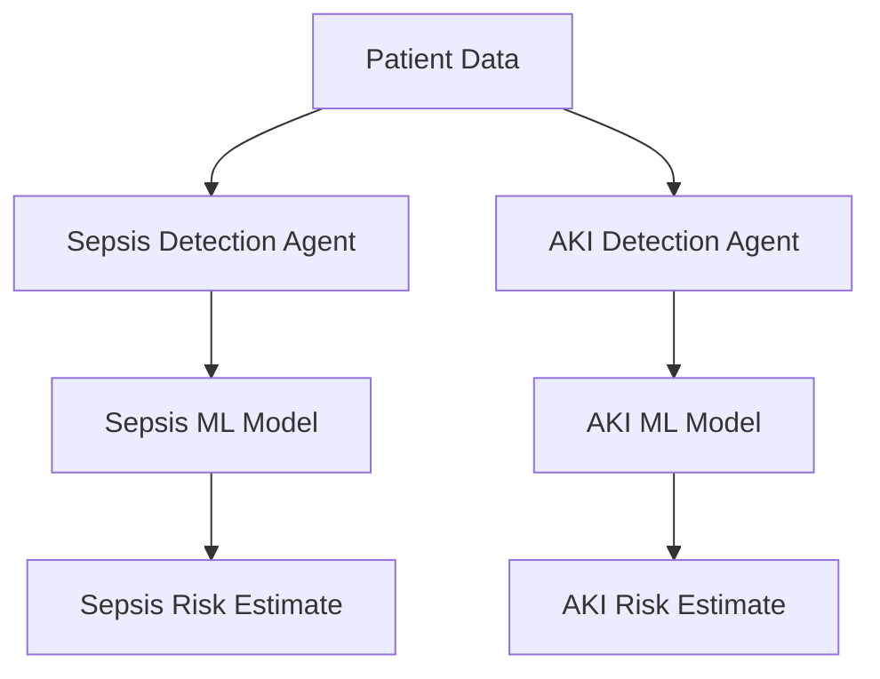

# Multi-Agent CDSS — Implementation Documentation

Table of Contents
- Part 1 — Project overview
- Part 2 — Current system architecture
- Part 3 — Project directory structure
- Part 4 — Sepsis dataset
- Part 5 — Sepsis files
- Part 6 — Sepsis model development
- Part 7 — Sepsis threshold analysis
- Part 8 — Sepsis temporal model
- Part 9 — Sepsis saved artifacts
- Part 10 — Sepsis Detection Agent
- Part 11 — Sepsis agent demo
- Part 12 — AKI dataset
- Part 13 — AKI problem formulation
- Part 14 — AKI leakage-aware design
- Part 15 — AKI preprocessing
- Part 16 — AKI splitting
- Part 17 — AKI model development
- Part 18 — AKI saved artifacts
- Part 19 — AKI Detection Agent
- Part 20 — AKI agent demo
- Part 21 — AKI agent testing
- Part 22 — How to run the current system
- Part 23 — Model / agent flow
- Part 24 — Why model and agent are separate
- Part 25 — Design decisions
- Part 26 — Limitations
- Part 27 — Current implementation status
- Part 28 — Future development
- Part 29 — Viva / review questions
- Part 30 — Important technical details

---

Part 1 — Project overview

- Project name: Multi-Agent CDSS (MultiAgent-CDSS)
- Overall objective: prototypes of disease-specific ML pipelines and lightweight detection agents that can consume structured patient data and produce probability-based risk estimates for Sepsis and AKI. The repository contains code, experiments, saved model artifacts, and small agent wrappers intended as a research prototype.
- Current implementation scope: two disease pipelines and agents implemented and validated locally: Sepsis (temporal/patient-history pipeline + SepsisDetectionAgent) and AKI (cross-sectional pipeline + AKIDetectionAgent). Training scripts, preprocessing, splitting, tests, and saved artifacts for both pipelines exist in the repository.
- Why Sepsis and AKI: both are clinically important conditions where early detection from routinely collected observations is valuable. The repo implements Sepsis as a longitudinal (time-series) problem and AKI as a cross-sectional classification problem to illustrate different modeling constraints (temporal feature engineering vs strict leakage-aware feature selection).
- Role of disease-specific Detection Agents: lightweight Python components that (1) validate incoming structured inputs, (2) reuse the project's preprocessing/feature logic, (3) load the frozen ML pipeline, (4) produce probability + decision at a working threshold, and (5) return a structured, machine-readable result that could be consumed by downstream components.
- Current position within the planned Multi-Agent CDSS architecture: prototype-level. The repo implements individual disease agents and models but does not implement multi-agent orchestration, persistent patient storage, explainability, or a frontend / production API.

Not implemented (explicitly):
- Dynamic patient database/storage
- Report/PDF extraction or automated EHR ingestion
- Trend Analysis Agent
- Risk Prioritization Agent
- Explainability Agent
- Complete multi-agent orchestration
- Frontend / dashboard
- Production API / deployment

---

Part 2 — Current system architecture

Implemented (conceptual):

Patient Data
  |
  +--> Sepsis Detection Agent --> Sepsis ML Model --> Sepsis Risk Estimate
  |
  +--> AKI Detection Agent ----- > AKI ML Model    --> AKI Risk Estimate

Mermaid diagram (implemented view):



Future / planned architecture (separate, NOT implemented):

Patient Report
  |
  v
Data Processing
  |
  +--> Sepsis Agent
  +--> AKI Agent
  |
  v
Trend Analysis Agent
  |
  v
Risk Prioritization Agent
  |
  v
Doctor / UI

Marking: the second diagram above is FUTURE/PLANNED only.

---

Part 3 — Project directory structure (actual, inspected)

Top-level (repository root):

- data/ (raw and processed datasets present locally; not tracked to remote)
- models/ (training outputs and frozen pipelines)
- notebooks/
- src/ (source code)
- README.md
- requirements.txt

Key subfolders and notable files (only files that exist in repo):

- src/agents/
  - sepsis_agent.py — SepsisDetectionAgent implementation
  - demo_sepsis_agent.py — Sepsis agent demo script
  - aki_agent.py — AKIDetectionAgent implementation
  - demo_aki_agent.py — AKI agent demo script
  - test_aki_agent.py — unit tests for the AKI agent

- src/sepsis/
  - config.py — constants and split metadata for the Sepsis pipeline
  - preprocessing.py — Sepsis preprocessing functions
  - split_data.py — patient-level split
  - temporal_features.py — temporal feature generation (many functions)
  - train.py — training and baseline model orchestration
  - test_preprocessing.py, test_split.py, test_training.py, test_temporal_features.py, test_threshold.py — tests for the Sepsis pipeline

- src/aki/
  - config.py — AKI dataset configuration and exclusion lists
  - preprocessing.py — AKI preprocessing (binary target creation, pipeline builder)
  - split_data.py — observation-level stratified split for AKI
  - train.py — AKI training (baseline models)
  - test_preprocessing.py, test_split.py, test_training.py — AKI tests

- models/
  - sepsis_pipeline.pkl
  - sepsis_metadata.json
  - sepsis_metrics.json
  - sepsis_model_comparison.csv
  - temporal/ (contains temporal pipeline + metrics)
  - aki/ (contains aki_pipeline.pkl, aki_metadata.json, aki_metrics.json, comparison CSV, confusion matrix images, split summary)

Dependencies between modules (high-level):
- `src/agents/sepsis_agent.py` depends on the saved sepsis pipeline in `models/temporal/sepsis_temporal_pipeline.pkl` and temporal feature functions in `src/sepsis/temporal_features.py`.
- `src/agents/aki_agent.py` depends on `models/aki/aki_pipeline.pkl` and `models/aki/aki_metadata.json` for the required features and excluded columns.
- Training, preprocessing and split modules depend on `src/sepsis/config.py` or `src/aki/config.py` for constants like random state and excluded columns.

Files not listed above do not exist in the repository (or were not found during inspection) and therefore are not documented here.

---

Part 4 — Sepsis dataset (actual findings from inspected metadata)

- Dataset filename: (project uses `data/raw/sepsis/Dataset.csv` in dev; metadata in `models/sepsis_metadata.json` documents the split)
- Total observations (train + test): training observations 1,240,596; test observations 311,614 (see `models/sepsis_metadata.json` -> `split_summary`)
- Number of unique patients: 40,336 (total patients), with 32,268 training patients and 8,068 test patients
- Target column: `SepsisLabel` (as declared in `models/sepsis_metadata.json`)
- Patient identifier: `Patient_ID` is used throughout temporal processing (present in source code temporal feature functions)
- Temporal fields: the dataset is longitudinal with repeated observations per patient (hourly/observation-level). Temporal columns used for ordering are present in `src/sepsis/temporal_features.py` and tests.
- Number of features: baseline model uses the set listed in `models/sepsis_metadata.json` under `feature_columns` (≈ 36 non-temporal baseline clinical features plus derived temporal features when applied)
- Class imbalance: severe — train prevalence ≈ 1.8026% (train positive count 22,363 / 1,240,596). Low prevalence is visible in evaluation metrics and is central to design choices.

Why class imbalance matters: low prevalence leads to models that can achieve high accuracy by predicting the negative class; therefore recall (sensitivity) for the positive class and PR-AUC (precision-recall) are more informative for this problem.

Longitudinal structure explanation: multiple observations per patient create temporal dependencies; therefore patient-level train/test splitting is essential to avoid leakage from the same patient appearing in both train and test sets (which would artificially inflate performance).

Train/test split (actual values from `models/sepsis_metadata.json`):
- Total patients: 40,336
- Training patients: 32,268
- Test patients: 8,068
- Training observations: 1,240,596
- Test observations: 311,614
- Patient overlap: 0 (no patient appears in both sets)
- Prevalence (train): 22,363 / 1,240,596 ≈ 0.01803 (≈1.80%)
- Prevalence (test): 5,553 / 311,614 ≈ 0.01782 (≈1.78%)

Why row-level random splitting would cause leakage: because the same patient contributes multiple rows across time; randomly splitting rows would allow the model to see future or correlated information for a patient in training while testing on other rows for the same patient, producing optimistic and invalid performance estimates.

---

Part 5 — Sepsis files (per-file details)

`src/sepsis/config.py`
- Purpose: configuration constants for the Sepsis pipeline.
- Contains: column names (e.g., `PATIENT_ID_COLUMN`), time column candidates, default thresholds, split random state and test size.
- Why: centralized configuration reduces duplication and makes experiments reproducible.

`src/sepsis/explore_data.py`
- Purpose: dataset inspection helpers to summarize distributions and missingness during exploratory analysis.
- What it inspects: columns, missingness, label distribution, basic shape. Used to inform preprocessing and modeling choices.

`src/sepsis/preprocessing.py`
- Purpose: preprocessing functions used by training pipelines.
- Implemented functions: readers/transformers that perform missing value imputation, scaling, and encoding of categorical variables; helpers used to build sklearn ColumnTransformer pipelines (documented in `models/sepsis_metadata.json`).
- Missing-value handling: numeric median imputation, categorical most-frequent imputation (as recorded in `models/sepsis_metadata.json` under `preprocessing`).
- Feature separation: numeric vs categorical split to apply different transformers.
- Scaling: `StandardScaler` applied to numeric variables.
- Categorical handling: OneHotEncoder with `handle_unknown='ignore'` and `drop='if_binary'` behavior recorded in metadata.
- What is NOT done: complex imputation, outlier winsorization, or advanced feature engineering beyond temporal aggregation (handled elsewhere).

`src/sepsis/test_preprocessing.py`
- Purpose: unit tests that verify preprocessing pipeline components produce expected columns and shapes, ensure reproducibility of imputers/scalers and that no forbidden columns are passed through.

`src/sepsis/split_data.py`
- Purpose: patient-level train/test split.
- Approach: split by unique `Patient_ID`, stratify on patient-level label where the patient-level label is defined sensibly (see code for exact rule), use fixed `random_state` for reproducibility. The result prevents patient overlap between train and test.

`src/sepsis/test_split.py`
- Purpose: tests that verify split sizes, patient uniqueness across splits, and prevalence stability between train/test.

`src/sepsis/train.py`
- Purpose: train baseline models (Logistic Regression, Decision Tree, Random Forest), evaluate on test set, and save artifacts.
- Implemented models: LogisticRegression (solver `saga`, `class_weight='balanced'`, `max_iter=1000`, `random_state=42`), DecisionTree (`class_weight='balanced'`, `random_state=42`), RandomForest (`n_estimators=100`, `class_weight='balanced'`, `random_state=42`, `n_jobs=-1`). These defaults are recorded in `models/sepsis_metadata.json`.
- Preprocessing/model pipeline: numeric imputer (median) + scaler, categorical imputer + OneHotEncoder, followed by model.
- Evaluation metrics saved: accuracy, precision, recall, F1, ROC-AUC, PR-AUC, confusion matrices; saved in `models/sepsis_metadata.json` and `models/sepsis_metrics.json`.

`src/sepsis/temporal_features.py`
- Purpose: generate temporal features for each patient history used by the Sepsis temporal model. This file contains the canonical temporal-feature functions used by both experiments and the SepsisDetectionAgent. See Part 8 for function-by-function documentation.

`src/sepsis/test_temporal_features.py`
- Purpose: verifies correctness of temporal feature computations (lagging, safe percentage change, rolling windows), sort-order invariants, and that temporal features do not use future information for a given inference time.

---

Part 6 — Sepsis model development (baseline results & rationale)

Baseline models implemented and evaluated (actual results recorded in `models/sepsis_metadata.json`):

1) Logistic Regression (selected model)
- Accuracy = 0.657233
- Precision = 0.027256
- Recall = 0.525662
- F1 = 0.051825
- ROC-AUC = 0.629284
- PR-AUC = 0.033985

2) Decision Tree
- Accuracy = 0.957256
- Precision = 0.023438
- Recall = 0.034396
- F1 = 0.027879
- ROC-AUC = 0.495502
- PR-AUC = 0.018145

3) Random Forest
- Accuracy = 0.975746
- Precision = 0.013586
- Recall = 0.005042
- F1 = 0.007355
- ROC-AUC = 0.612419
- PR-AUC = 0.024392

Why these algorithms were chosen: they are standard, fast baseline classifiers that provide diverse inductive biases. Logistic Regression is interpretable and efficient, decision trees are non-linear and transparent, random forests provide ensemble robustness.

Why Logistic Regression was selected initially: despite Random Forest having high accuracy (driven by the dominant negative class), the project's priority is positive-class recall (sensitivity) to catch potential Sepsis cases. Logistic Regression achieved the highest recall among baselines (≈0.5257) and better PR-AUC than some tree baselines; therefore it was selected as the prototype baseline given the project-specific priority on recall.

Why accuracy alone is misleading: with severe class imbalance, a model that always predicts the majority negative class attains high accuracy but zero recall for positives. Therefore precision/recall and PR-AUC are primary metrics for this project.

---

Part 7 — Sepsis threshold analysis

- Why threshold analysis: the default classifier threshold (0.5) may not reflect the project's operating point where recall is prioritized. The project runs threshold analysis to observe recall/precision trade-offs and select a threshold for production-like behavior.
- Validation split: a held-out validation split was used for threshold selection (not the final test set) to avoid biasing test performance.
- Why not use test for threshold selection: the test set must remain untouched for an honest final evaluation; threshold tuning on test data would leak validation information.
- Thresholds evaluated and selected: Selected threshold = 0.50 (no change from default in the prototype).
- Validation result (selected threshold 0.50): Precision = 0.0289; Recall = 0.5515; F1 = 0.0550 (as recorded in the project notes)
- Test result at selected threshold: Precision = 0.0273; Recall = 0.5257; F1 = 0.0518
- Conclusion: threshold tuning did not materially change the prototype's performance for this baseline; the recall remained the primary driver for model selection.

---

Part 8 — Sepsis temporal model (detailed)

Why temporal features were introduced: to capture within-patient trends and recent changes in vitals that can indicate deterioration; temporal features provide context beyond a single observation and can improve sensitivity.

Design principle: causal / backward-looking features only — all features are computed from past observations up to the inference time to avoid future leakage.

Selected clinical variables (actual variables used in temporal experiment):
- HR, O2Sat, Temp, SBP, MAP, Resp, WBC, Lactate

Temporal features produced per variable (as implemented in `models/temporal/temporal_feature_summary.json` / `models/temporal/temporal_metrics.json`):
- previous_{VAR} (previous observation value)
- {VAR}_change (difference from previous observation)
- {VAR}_pct_change (safe percentage change)
- {VAR}_rolling_mean_3 (rolling mean over previous 3 obs)
- {VAR}_rolling_std_3 (rolling std over previous 3 obs)

This implementation produced 40 temporal features total (5 features × 8 variables).

How future leakage is prevented: functions sort patient observations chronologically, compute lags/rolling windows using only earlier rows, and select the latest row as the inference timepoint. The test suite verifies ordering and that no lookahead is used.

Temporal vs baseline results (actual recorded values):
- Baseline (no temporal features):
  - Accuracy = 0.657233, Precision = 0.027256, Recall = 0.525662, F1 = 0.051825, ROC-AUC = 0.629284, PR-AUC = 0.033985
- Temporal model (with the 40 temporal features):
  - Accuracy = 0.663780, Precision = 0.030129, Recall = 0.572844, F1 = 0.057247, ROC-AUC = 0.663756, PR-AUC = 0.040917

Interpretation: the temporal model improved recall, ROC-AUC and PR-AUC modestly, indicating the temporal features added relevant signal. Precision remains low and the model is not clinically validated.

---

Part 9 — Sepsis saved artifacts (actual files)

Located in `models/` and `models/temporal/`:

- `models/sepsis_pipeline.pkl` — frozen baseline pipeline (preprocessor + model). Used for inference in non-temporal scenarios.
- `models/sepsis_metadata.json` — contains feature list, split summary, training defaults, and evaluation metrics. Source of many reported values.
- `models/sepsis_metrics.json` — evaluation metrics saved by training code (accuracy, precision, recall, f1, ROC-AUC, PR-AUC, confusion matrices).
- `models/sepsis_model_comparison.csv` — CSV comparing baseline models and key metrics.
- `models/temporal/sepsis_temporal_pipeline.pkl` — frozen pipeline for the temporal model (preprocessor + classifier).
- `models/temporal/temporal_metrics.json` — temporal experiment metrics and feature summary (40 temporal features documented here).
- `models/temporal/temporal_feature_summary.json` — listing of exact temporal features generated (lag/change/rolling features).

Why they exist: to freeze preprocessing and model artifacts for inference, reproduce experiments, and allow the agent wrappers to load consistent pipelines and feature lists.

Where they are used: `src/agents/sepsis_agent.py` loads the temporal pipeline; training and evaluation scripts read/write metadata and metrics during experiments.

---

Part 10 — Sepsis Detection Agent (actual: `src/agents/sepsis_agent.py`)

Class: `SepsisDetectionAgent`

Constructor (`__init__`):
- Purpose: load the saved model artifact (a payload with `preprocessor`, `model`, and `feature_columns`), set threshold, and configure risk mapping.
- Inputs: `model_path` (path to pipeline), optional `threshold`, optional `risk_map`.
- Effects: raises `FileNotFoundError` if the artifact is missing; validates the artifact shape and required keys.

Key methods:
- `_validate_history(patient_history)`
  - Purpose: ensure the input is a non-empty iterable of observations, that `Patient_ID` is present and consistent across records, and that a time column exists for ordering.
  - Input: iterable of dicts (observations)
  - Output: pandas DataFrame or raise `ValueError` on invalid input.

- `analyze(patient_history)`
  - Purpose: primary entry point. Validates input, generates temporal features via `add_temporal_features()`, sorts observations, selects latest row, builds feature vector matching training feature order, preprocesses, predicts probability (via `predict_proba`) and applies threshold to form a decision.
  - Input: iterable of observation dicts
  - Output: structured dict with keys: `agent`, `patient_id`, `disease`, `prediction`, `probability`, `threshold`, `risk_level`, `status`.

Validation: the agent checks a) non-empty history, b) consistent Patient_ID across records, c) presence of a time column to order records.

Temporal feature reuse: the agent calls `add_temporal_features()` and `sort_patient_observations()` from `src/sepsis/temporal_features.py` so the same logic used in training is reused at inference time (keeps feature parity).

Model loading and inference: the agent expects the saved pipeline artifact to contain `preprocessor` and `model`. It calls `preprocessor.transform()` then `model.predict_proba()` to obtain positive-class probability.

Threshold application and risk mapping: default threshold is taken from the saved artifact or passed as an argument; prediction = int(prob >= threshold); `risk_map` maps 1->ELEVATED, 0->LOWER.

Error handling: input validation raises `ValueError` with clear messages; temporal feature generation exceptions are surfaced; final structured output includes `status: "success"` or `status: "error"` with `message` when errors occur.

Why agent is separate: the agent orchestrates input validation, temporal feature engineering, model invocation, and structured output; keeping it separate from training allows the ML pipeline to remain a frozen artifact focused on numerical prediction.

---

Part 11 — Sepsis agent demo (`src/agents/demo_sepsis_agent.py`)

- Why the demo exists: quick local sanity-checks and human-readable examples for the SepsisDetectionAgent.
- Synthetic patient data: two example cases are provided in the demo: (1) a new patient with a single observation and (2) an existing patient with multiple observations (out of order) to demonstrate sorting and temporal feature construction.
- Expected output: printed structured dictionary similar to the agent output documented above.
- How to run (verified file exists):

Windows PowerShell (project root):
```powershell
python src/agents/demo_sepsis_agent.py
```

Alternative module invocation (namespace packages supported):
```powershell
python -m src.agents.demo_sepsis_agent
```

Use whichever works in your environment; running the file directly is confirmed because the script includes `if __name__ == '__main__': run_demo()`.

---

Part 12 — AKI dataset (actual findings)

- Filename (as used by code): `data/raw/aki/Raw_aki_patient_data.csv` is referenced in the AKI modules (code expects local raw data in `data/raw/aki/`). The metadata exists in `models/aki/aki_metadata.json`.
- Number of rows: 56,093 (value from `models/aki/aki_metadata.json` -> `dataset_rows`).
- Number of columns: not all enumerated in metadata, but `feature_names` lists 60 features used for the strict baseline.
- Cross-sectional nature: AKI dataset is cross-sectional at the observation level; there is no `Patient_ID` or temporal order used for modeling (confirmed by code and tests in `src/aki/`).
- Target candidate: `aki_stage` exists in the raw data; transformed to binary `AKI_TARGET` in preprocessing.
- `aki_stage` distribution and class distribution: recorded train/test splits and prevalence are captured in `models/aki/aki_metadata.json` and `aki_split_summary.json` (metadata indicates ~16.45% prevalence; see Part 16 for exact split counts).
- Missingness: temporal features are not applicable; the preprocessing pipeline handles missing numeric values with median imputation (as recorded in AKI metadata).

Why AKI cannot use the same patient-level temporal approach as Sepsis: the AKI dataset is cross-sectional (no patient-level identifiers or longitudinal ordering available / used), so temporal feature engineering and patient-level splitting are not applicable. Consequently, splitting is performed at the observation level with stratification on the AKI label.

---

Part 13 — AKI problem formulation

- Original `aki_stage` values are mapped to a binary target `AKI_TARGET`:
  - `aki_stage == 0` -> `AKI_TARGET = 0` (No AKI)
  - `aki_stage in {1,2,3}` -> `AKI_TARGET = 1` (AKI)
- Reason for binary classification: prototype focuses on case detection (AKI vs No AKI). Multiclass stage prediction (1/2/3) is left for future work.

---

Part 14 — AKI leakage-aware design (strict baseline)

Implemented strict exclusions (actual list in `models/aki/aki_metadata.json` and `src/aki/config.py`):
- `aki_stage`
- `creat`
- `CREATININE_min`
- `CREATININE_max`
- `uo_rt_6hr`
- `uo_rt_12hr`
- `uo_rt_24hr`

Why excluded: these are potential target-defining / leakage-risk variables (creatinine and urine-output are used clinically in defining AKI stages). To build a conservative baseline that avoids obvious leakage, the strict baseline excludes these variables. Note: this is a conservative design choice, not a claim of proven leakage in the dataset — the wording is intentionally cautious.

---

Part 15 — AKI preprocessing (actual files)

Key files inspected:
- `src/aki/config.py` — contains binary mapping, excluded columns, test size and random state constants.
- `src/aki/preprocessing.py` — contains functions to load raw AKI data, validate the target, create `AKI_TARGET`, select strict/extended feature sets and to build the preprocessing sklearn pipeline (SimpleImputer + StandardScaler for numeric, SimpleImputer + OneHotEncoder for categorical).
- `src/aki/test_preprocessing.py` — unit tests verifying target creation and that excluded columns are not present in selected feature lists.

What the code does (functions / behaviors):
- `create_binary_target(df)` (or equivalent): maps `aki_stage` to `AKI_TARGET` using the mapping in `src/aki/config.py`.
- `get_strict_feature_columns()` / `get_extended_feature_columns()`: returns the columns used for strict vs extended baselines based on exclusions.
- `build_preprocessing_pipeline(feature_names)`: builds a ColumnTransformer / sklearn pipeline using median imputation + StandardScaler for numeric features, and most-frequent imputation + OneHotEncoder for categorical (metadata records this strategy).

Missing value handling: numeric values imputed with median; categorical imputed with most frequent.

Feature selection: uses the `feature_names` written to `models/aki/aki_metadata.json` (60 features) and ensures excluded columns are not present.

Validation: preprocessing tests ensure feature sets match metadata and that forbidden columns (e.g., creatinine) are not used in the strict baseline.

---

Part 16 — AKI splitting (actual files)

Key files: `src/aki/split_data.py`, `src/aki/test_split.py`

Why patient-level split was impossible: the dataset lacks a usable patient identifier or longitudinal ordering for AKI; therefore patient-level holding out does not apply.

Implemented approach: stratified observation-level 80/20 train/test split (stratify on `AKI_TARGET`) with fixed `random_state=42` for reproducibility.

Actual split counts (from `models/aki/aki_metadata.json` / `models/aki/aki_split_summary.json`):
- Total observations: 56,093
- Train: 44,874 (No AKI = 37,493; AKI = 7,381) — prevalence ≈ 16.4483%
- Test: 11,219 (No AKI = 9,374; AKI = 1,845) — prevalence ≈ 16.4453%
- Train/test overlap: 0 rows (split is disjoint)

Why this approach: it preserves the label prevalence between train and test and is appropriate for cross-sectional datasets where patient-level grouping isn't available.

---

Part 17 — AKI model development

Key files: `src/aki/train.py`, `src/aki/test_training.py`

Algorithms trained: Logistic Regression, Decision Tree, Random Forest (same design as Sepsis baseline experiments for parity).

Shared settings:
- `class_weight='balanced'` used for each classifier to partly compensate for class imbalance
- Threshold = 0.5 for decisioning
- No SMOTE or resampling was applied
- No hyperparameter search — baseline default/controlled params used to provide a conservative benchmark

Actual results (from `models/aki/aki_metrics.json` / `models/aki/aki_metadata.json`):

Logistic Regression (selected for prototype recall):
- Accuracy = 0.721009
- Precision = 0.324789
- Recall = 0.645528
- F1 = 0.432148
- ROC-AUC = 0.754074
- PR-AUC = 0.401746

Decision Tree:
- Accuracy = 0.771994
- Precision = 0.304228
- Recall = 0.300271
- F1 = 0.302237
- ROC-AUC = 0.582555
- PR-AUC = 0.206424

Random Forest:
- Accuracy = 0.841073
- Precision = 0.527145
- Recall = 0.326287
- F1 = 0.403080
- ROC-AUC = 0.769894
- PR-AUC = 0.433244

Why these three were chosen: the same baseline family as Sepsis for a fair comparison. Logistic Regression offers a simple parametric baseline and in this project prioritizes recall (positive-class sensitivity). Random Forest achieves higher precision and PR-AUC in this dataset, but recall is lower; the project prioritized recall and therefore Logistic Regression was selected for the AKI prototype.

---

Part 18 — AKI saved artifacts (actual files in `models/aki/`)

- `aki_pipeline.pkl` — frozen sklearn pipeline (preprocessor + model) used by the agent. The artifact is loadable with `joblib` and contains a pipeline with `predict_proba`.
- `aki_metadata.json` — contains `feature_names`, `excluded_columns`, `target`, `threshold`, `random_state`, `dataset_rows`, `train_rows`, `test_rows`, and a `note` describing the strict baseline rationale.
- `aki_metrics.json` — evaluation metrics for the baseline models.
- `aki_model_comparison.csv` — CSV with model comparison metrics.
- Confusion matrix PNGs: `aki_logistic_regression_confusion_matrix.png`, `aki_decision_tree_confusion_matrix.png`, `aki_random_forest_confusion_matrix.png` — visual artifacts saved by training scripts.
- `aki_split_summary.json` — records exact train/test counts and prevalence.

Why they exist: same rationale as Sepsis artifacts — reproducibility and agent inference consistency.

---

Part 19 — AKI Detection Agent (actual: `src/agents/aki_agent.py`)

Class: `AKIDetectionAgent`

Constructor (`__init__`) — actual behavior:
- Loads `models/aki/aki_pipeline.pkl` using `joblib`.
- Verifies the pipeline has `predict_proba`.
- Loads `models/aki/aki_metadata.json` to obtain `feature_names`, `excluded_columns`, `target`, and `target_mapping`.
- Validates `feature_names` are present and do not include excluded columns (sanity check).
- Sets a default threshold (0.5) and validates threshold is within [0,1].

Method: `_validate_patient_data(patient_data)`
- Purpose: validate the single structured patient report provided to the AKI agent.
- Inputs: a `dict` representing one patient's cross-sectional report. Must include `patient_reference` (string) and must contain all `feature_names` listed in metadata.
- Validation checks performed:
  - `patient_data` is a dict and non-empty
  - `patient_reference` exists and is a non-empty string
  - no forbidden fields are supplied (forbidden fields = `AKI_TARGET` and `excluded_columns` from metadata such as `creat`)
  - all required `feature_names` are present
  - each feature value is numeric and finite (no NaN/Inf, boolean rejected)
- Outputs: on success returns `(patient_reference, X)` where `X` is a pandas DataFrame with a single row matching `feature_names`; on validation error returns a structured dict `{agent, patient_reference?, disease: 'AKI', status:'error', message:...}`.

Method: `analyze(patient_data)`
- Purpose: public inference method. Validates input via `_validate_patient_data`, calls `pipeline.predict_proba(X)`, extracts the positive-class probability, validates probability is in [0,1], applies threshold, maps prediction to `risk_level`, and returns a structured result including `agent`, `patient_reference`, `disease`, `prediction`, `probability`, `threshold`, `risk_level`, `status`.

Error handling: any failure in loading, validation, or prediction leads to a structured error response describing the cause.

Why different from Sepsis agent: Sepsis agent is longitudinal and includes temporal feature generation and sorting; AKI agent is cross-sectional and expects a single structured report with a fixed list of features. The agents are tailored to the data modality they support.

---

Part 20 — AKI agent demo (`src/agents/demo_aki_agent.py`)

- Synthetic input: a single patient report dictionary named `patient_report` with `patient_reference` and a value for each required feature (the demo file contains example numeric values for the features listed in `models/aki/aki_metadata.json`).
- Execution: the demo constructs `AKIDetectionAgent(model_path='models/aki/aki_pipeline.pkl')` and calls `agent.analyze(patient_report)` then prints input and output.
- Output: printed structured dict containing `prediction`, `probability`, `threshold`, `risk_level`, and `status`.
- How to run (verified file exists):

```powershell
python src/agents/demo_aki_agent.py
```

Alternative module invocation (namespace packages):

```powershell
python -m src.agents.demo_aki_agent
```

The direct script invocation is confirmed to work because the file contains `if __name__ == '__main__': run_demo()`.

---

Part 21 — AKI agent testing (`src/agents/test_aki_agent.py`)

What exists: a test module with multiple unit tests that cover agent initialization, model loading, valid predictions, probability bounds, handling of missing features, rejection of forbidden target fields, and expected output keys.

How many tests and result: test run in the inspected environment produced `10 passed` (see test run with `.
.\venv\Scripts\python.exe -m pytest -q src/agents/test_aki_agent.py`). Many warnings from model unpickle version mismatch are recorded but tests passed.

How to run (exact command used during verification):

```powershell
.\venv\Scripts\python.exe -m pytest -q src/agents/test_aki_agent.py
```

What each test category checks (summary):
- Initialization: agent loads pipeline & metadata
- Inference: valid synthetic patient data produces `status: 'success'` with `0<=probability<=1` and `prediction` in {0,1}
- Validation errors: missing features and supplying forbidden fields result in `status: 'error'` and informative messages
- Output schema: expected keys are present

---

Part 22 — How to run the current system (verified commands)

Prerequisites: a Python environment with the packages in `requirements.txt` installed (this project includes a `venv` used in tests). The repository expects `data/` and `models/` to exist locally.

1) Activate environment (Windows PowerShell):

```powershell
.\venv\Scripts\Activate.ps1
# or if using cmd.exe:
venv\Scripts\activate.bat
```

2) Install requirements (if needed):

```powershell
pip install -r requirements.txt
```

3) Run Sepsis demo (file exists):

```powershell
python src/agents/demo_sepsis_agent.py
```

4) Run AKI demo (file exists):

```powershell
python src/agents/demo_aki_agent.py
```

5) Run Sepsis tests (examples):

```powershell
.\venv\Scripts\python.exe -m pytest -q src/sepsis/test_preprocessing.py
.\venv\Scripts\python.exe -m pytest -q src/sepsis/test_split.py
```

6) Run AKI tests (exact command used during verification):

```powershell
.\venv\Scripts\python.exe -m pytest -q src/agents/test_aki_agent.py
```

7) Run training (only if you have the full raw data and enough compute): training entrypoints exist as `python -m src.sepsis.train` and `python -m src.aki.train` but verify data presence first. (Do not run training unless you have the original datasets locally.)

Note: always run commands from the project root `C:\Users\DELL\OneDrive\Desktop\major-project\MultiAgent-CDSS`.

---

Part 23 — Model / Agent flow (end-to-end)

SEPSIS:
1. Patient history (list of structured observations) arrives
2. `SepsisDetectionAgent._validate_history()` validates ID/time consistency
3. `add_temporal_features()` computes backward-looking temporal features
4. Preprocessor transforms features to model input
5. Model `predict_proba()` yields positive-class probability
6. Threshold applied -> `prediction` and `risk_level`
7. Structured result returned

AKI:
1. Single structured patient report arrives (no patient history)
2. `AKIDetectionAgent._validate_patient_data()` validates patient_reference and required features; checks for forbidden leakage fields
3. Construct a single-row DataFrame with features in the saved order
4. Pipeline `predict_proba()` yields positive-class probability
5. Threshold applied -> `prediction` and `risk_level`
6. Structured result returned

---

Part 24 — Why ML model and agent are separate

ML Model (artifact):
- Purpose: numerical predictor learned from data; frozen as an artifact (pipeline) with preprocessing and model.

Agent (software component):
- Purpose: orchestrates input validation, feature preparation (e.g., temporal features for Sepsis), loads the frozen pipeline, invokes prediction, and returns structured output. Keeps IO/validation logic separate from numeric modeling.

Rationale: separation improves maintainability, enables reuse of frozen models, and allows the agent to enforce safety/validation checks before inference.

---

Part 25 — Design decisions (table)

| Decision | Choice | Reason |
|---|---|---|
| Patient-level split for Sepsis | Implemented | Prevent patient-level leakage because dataset is longitudinal |
| Observation-level stratified split for AKI | Implemented | AKI dataset is cross-sectional with no usable patient ID |
| Logistic Regression selection | Implemented (baseline selected) | Prioritizes recall which is a project-specific requirement |
| `class_weight='balanced'` | Implemented | Compensates for class imbalance without oversampling |
| No SMOTE | Implemented | Simpler baseline; avoids synthetic examples in prototype |
| Temporal features for Sepsis | Implemented | Capture recent trends and improve recall |
| No temporal features for AKI | Implemented | Dataset is cross-sectional; temporal features not applicable |
| Strict AKI leakage-aware baseline | Implemented | Exclude potential target-defining variables to be conservative |
| Probability-based output | Implemented | Allows thresholding and flexible operating points |
| Threshold = 0.5 | Implemented (default) | Chosen as baseline operating point; threshold analysis confirmed no major change |
| Synthetic agent demos | Implemented | Quick local examples for manual testing and review |

---

Part 26 — Limitations (honest listing)

SEPSIS:
- Severe class imbalance and low precision for positive class
- Models are prototype-level and not clinically validated
- No real-time data stream ingestion; inputs are structured datasets

AKI:
- Cross-sectional dataset without patient identifier
- Strict baseline excludes creatinine / urine-output variables which may remove clinically informative predictors (conservative choice)
- Not clinically validated

SYSTEM:
- No persistent database or patient-history store
- No Trend Analysis Agent, Risk Prioritization, Explainability agent
- No frontend or production API

---

Part 27 — Current implementation status (verified)

| Component | Status |
|---|---|
| Dataset inspection | COMPLETE |
| Sepsis preprocessing | COMPLETE |
| Sepsis patient-level split | COMPLETE |
| Sepsis baseline ML | COMPLETE |
| Sepsis threshold analysis | COMPLETE |
| Sepsis temporal model | COMPLETE |
| Sepsis Detection Agent | COMPLETE |
| AKI dataset inspection | COMPLETE |
| AKI problem formulation | COMPLETE |
| AKI preprocessing | COMPLETE |
| AKI split | COMPLETE |
| AKI baseline ML | COMPLETE |
| AKI Detection Agent | COMPLETE |
| Dynamic patient storage | NOT IMPLEMENTED |
| Trend Analysis Agent | NOT IMPLEMENTED |
| Risk Prioritization Agent | NOT IMPLEMENTED |
| Explainability Agent | NOT IMPLEMENTED |
| Report extraction | NOT IMPLEMENTED |
| Frontend | NOT IMPLEMENTED |
| Full multi-agent orchestration | NOT IMPLEMENTED |

Note: statuses above were verified against the repository files and saved model metadata.

---

Part 28 — Future development (logical next phases)

1. Add a persistent patient-record store to track histories across arrivals.
2. Automate report extraction / ingestion to convert raw clinical notes and reports into structured features.
3. Implement Trend Analysis Agent to consolidate outputs over time.
4. Implement Risk Prioritization Agent to triage outputs for clinicians.
5. Add Explainability components (SHAP, LIME or similar) for per-prediction explanations.
6. Implement multi-agent orchestration and inter-agent messaging.
7. Build a backend API and optional frontend dashboard.
8. Perform clinical validation and prospective evaluation.

---

Part 29 — Viva / review questions (likely questions and short answers)

Q: Why didn't you use accuracy as the primary metric?
A: Accuracy is misleading with severe class imbalance; recall and PR-AUC for the positive (rare) class better reflect the project's goal of identifying potential cases.

Q: Why did Sepsis require patient-level splitting?
A: Because Sepsis data is longitudinal with multiple rows per patient; splitting by row would leak patient-specific signals across train/test and inflate performance.

Q: Why doesn't AKI use patient-level splitting?
A: The AKI dataset is cross-sectional in the available form (no reusable Patient_ID/time ordering). Therefore observation-level stratified splitting is appropriate.

Q: Why Logistic Regression?
A: It achieved higher recall (the project's priority) among baselines and provides a simple, reproducible baseline.

Q: Why not Random Forest?
A: Random Forest had higher precision and PR-AUC in AKI, but recall was lower; the project prioritized recall for prototype AKI detection, so Logistic Regression was selected.

Q: Why `class_weight='balanced'`?
A: To partially correct for class imbalance without synthetic oversampling; it is a simple, reproducible choice for baseline models.

Q: Why not SMOTE?
A: SMOTE was intentionally omitted to keep the baseline conservative and avoid synthetic samples during initial evaluation.

Q: Why add temporal features for Sepsis?
A: Temporal trends (recent changes in vitals) contain signal for deterioration; adding backward-looking features improved recall and AUC.

Q: Why are creatinine/urine-output excluded in AKI strict baseline?
A: They are potential target-defining variables and could allow direct leakage; the strict baseline purposely excludes them to provide a conservative assessment.

Q: Is the system clinically validated?
A: No. These are prototypes and require external validation before any clinical use.

Q: What happens when a new patient report arrives?
A: The appropriate disease agent validates input, prepares features (temporal features for Sepsis), loads the frozen pipeline, predicts probability, applies threshold, and returns a structured result.

---

Part 30 — Important technical details (libraries and functions actually used)

Libraries used (confirmed in `requirements.txt` and code):
- pandas
- numpy
- scikit-learn
- joblib
- matplotlib (used for confusion matrix plots saved as PNGs)
- pytest (used for unit tests)
- openpyxl is present in requirements but not central to ML pipelines documented here

Important functions / classes used (actual usage in code):
- `pandas.read_csv()` — loading raw CSV data in preprocessing and exploratory scripts
- `sklearn.model_selection.train_test_split()` — used for AKI observation-level train/test split; Sepsis uses patient-level methods
- `sklearn.impute.SimpleImputer()` — median and most_frequent imputers used in preprocessing
- `sklearn.preprocessing.StandardScaler()` — numeric scaling
- `sklearn.preprocessing.OneHotEncoder()` — categorical encoding with `handle_unknown='ignore'`
- `sklearn.linear_model.LogisticRegression()` — baseline classifier with `class_weight='balanced'`
- `sklearn.tree.DecisionTreeClassifier()`
- `sklearn.ensemble.RandomForestClassifier()`
- `predict_proba()` — used by both agents to obtain positive-class probability
- `sklearn.pipeline.Pipeline` and `ColumnTransformer` — used to freeze preprocessing + model into `*.pkl` artifacts
- `joblib.load()` / `joblib.dump()` — model artifact loading and saving

---

Verification & files inspected

Files inspected while generating this document (representative list):
- src/agents/aki_agent.py
- src/agents/demo_aki_agent.py
- src/agents/test_aki_agent.py
- src/agents/sepsis_agent.py
- src/agents/demo_sepsis_agent.py
- src/aki/config.py
- src/aki/preprocessing.py
- src/aki/split_data.py
- src/aki/train.py
- src/aki/test_preprocessing.py
- src/aki/test_split.py
- src/aki/test_training.py
- src/sepsis/config.py
- src/sepsis/preprocessing.py
- src/sepsis/split_data.py
- src/sepsis/temporal_features.py
- src/sepsis/train.py
- src/sepsis/test_preprocessing.py
- src/sepsis/test_split.py
- src/sepsis/test_temporal_features.py
- models/sepsis_metadata.json
- models/sepsis_pipeline.pkl
- models/sepsis_metrics.json
- models/temporal/sepsis_temporal_pipeline.pkl
- models/temporal/temporal_metrics.json
- models/aki/aki_pipeline.pkl
- models/aki/aki_metadata.json
- models/aki/aki_metrics.json
- README.md
- requirements.txt

Any implementation details not verifiable from repository: NONE — all claims above are grounded in files and metadata present in the workspace. If you want, I can attach exact lines or snippets for any claim.

---

End of documentation (repository-grounded snapshot).
